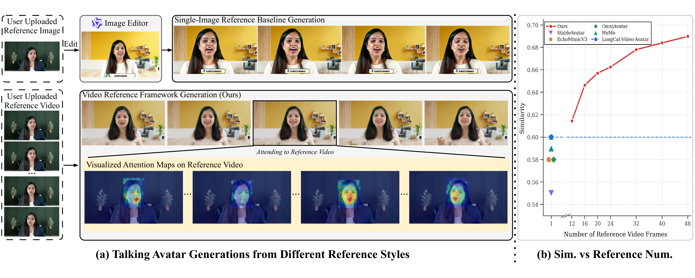

<h1 align="left"><a href="https://www.heygen.com/research"><picture><source media="(prefers-color-scheme: dark)" srcset="assets/heygen-logo-white.png"></picture></a>&nbsp; Generate Your Talking Avatar from Video Reference</h1>

<div align="center">

<div>
    <span class="author-block">
        <a href="https://gseancdat.github.io/" target="_blank">Zujin Guo</a><sup>1,2</sup>,</span>
    <span class="author-block">
        <a href="https://yerfor.github.io/en/" target="_blank">Zhenhui Ye</a><sup>1</sup>,</span>
    <span class="author-block">
        <a href="https://rayeren.github.io/" target="_blank">Yi Ren</a><sup>1</sup>,</span>
    <span class="author-block">
        <a href="https://openreview.net/profile?id=~Yuanming_Li3" target="_blank">Yuanming Li</a><sup>1</sup>,</span>
    <span class="author-block">
        <a href="https://openreview.net/profile?id=~Ce_Chen1" target="_blank">Ce Chen</a><sup>1,3</sup>,</span>
    <span class="author-block">
        <a href="https://openreview.net/profile?id=~Zhibin_Hong1" target="_blank">Zhibin Hong</a><sup>1</sup>,</span>
    <span class="author-block">
        <a href="https://www.mmlab-ntu.com/person/ccloy/index.html" target="_blank">Chen Change Loy</a><sup>2</sup>
</div>

<div class="is-size-5 publication-authors">
<span class="author-block"><sup>1</sup>HeyGen Research,</span>
<span class="author-block"><sup>2</sup>Nanyang Technological University,</span>
<span class="author-block"><sup>3</sup>University of Melbourne</span>
</div>

<div>
    <strong>SIGGRAPH Asia 2026</strong>
</div>

<div>
    <h4 align="center">
        <a href="https://gseancdat.github.io/projects/TAVR.html" target='_blank'>
        
        </a>
        <a href="https://arxiv.org/abs/2604.27918" target='_blank'>
        
        </a>
        <a href="https://huggingface.co/blog/HeyGenAI/tavr" target='_blank'>
        
        </a>
        
    </h4>
</div>



TAVR replaces single-image avatar references with short video clips, enabling cross-scene generation with significantly better identity preservation. A three-stage training strategy bridges the domain gap between reference and target scenes. On a new cross-scene benchmark, TAVR yields the best identity similarity and achieves an overall quality score of 16.42 vs 14.13 for the next best method.

:open_book: For more visual results of TAVR, go checkout our <a href="https://gseancdat.github.io/projects/TAVR.html" target="_blank">project page</a>.

---
</div>

## 🚩 News
* 📊 Cross-scene benchmark data is released: [`benchmark_data.json`](https://huggingface.co/HeyGenAI/TAVR/blob/main/benchmark_data.json) on Hugging Face!
* 🚀 Inference code is released!
* 🎉 **TAVR** has been accepted by SIGGRAPH Asia 2026!
## ⚙️ Installation
Python 3.10, tested on one Hopper-class CUDA GPU with at least 80 GB of memory, and `ffmpeg` / `ffprobe` on `PATH`.
```bash
python3.10 -m venv .venv
source .venv/bin/activate
pip install -r requirements.txt --extra-index-url https://download.pytorch.org/whl/cu126
```
`flash_attn_3` has no PyPI wheel: build it from [flash-attention](https://github.com/Dao-AILab/flash-attention) (the `hopper/` directory). FlashAttention 3 is the **only** attention backend.
## 📂 Preparation
1. **Base models**: [`Wan-AI/Wan2.1-T2V-14B`](https://huggingface.co/Wan-AI/Wan2.1-T2V-14B) (VAE, umT5) and [`facebook/wav2vec2-xlsr-53-espeak-cv-ft`](https://huggingface.co/facebook/wav2vec2-xlsr-53-espeak-cv-ft).
2. **Detectors**: [`yolo11x.pt`](https://github.com/ultralytics/ultralytics) (**AGPL-3.0**) and [`dw-ll_ucoco_384.onnx`](https://huggingface.co/yzd-v/DWPose) for whole-body pose (Apache-2.0).
3. **TAVR checkpoint**: the transformer `.safetensors`.
```text
TAVR/
├── pretrained/
│   └── Wan2.1-T2V-14B/
│       ├── Wan2.1_VAE.pth
│       ├── models_t5_umt5-xxl-enc-bf16.pth
│       ├── google/umt5-xxl/
│       ├── wav2vec2-xlsr-53-espeak-cv-ft/
│       ├── yolo11x.pt
│       └── dw-ll_ucoco_384.onnx
└── ckpt/
    └── tavr_transformer.safetensors
```
## 🚀 Demo
One sample per directory:
```text
TAVR/
└── samples/
    └── example1/
        ├── ref.mp4               # reference video of the person
        ├── target.png            # still of the target scene
        ├── target_caption.json   # {"caption": "..."} -- the positive prompt
        └── target.mp3            # driving audio (target.wav also works)
```
```bash
PYTHONPATH=. python infer.py \
  --sample-dir samples/example1 \
  --dit-ckpt ckpt/tavr_transformer.safetensors \
  --ckpt-dir . \
  --output-dir outputs
```
The result lands in `outputs/example1/generated_target.mp4`. 
## 📊 Benchmark
The cross-scene benchmark consists of 158 reference/target video pairs filtered from [TalkVid](https://github.com/FreedomIntelligence/TalkVid). Its metadata is released as [`benchmark_data.json`](https://huggingface.co/HeyGenAI/TAVR/blob/main/benchmark_data.json) on Hugging Face:
```bash
hf download HeyGenAI/TAVR benchmark_data.json --local-dir ./benchmark
```
Each sample has:
| field | content |
|---|---|
| `reference`, `target` | `video_id`, `video_url`, `start_time` / `end_time` (seconds), `start_frame` / `end_frame` at the source `fps`, `width`, `height` |
| `target_caption` | scene caption used as the text prompt |

The reference clip is the person's source video; the target clip provides the target still, the caption and the driving audio.
## 📝 Citation
```bibtex
@inproceedings{guo2026generate,
     title={Generate Your Talking Avatar from Video Reference},
     author={Guo, Zujin and Ye, Zhenhui and Ren, Yi and Li, Yuanming and Chen, Ce and Hong, Zhibin and Loy, Chen Change},
      booktitle={SIGGRAPH Asia 2026 Conference Papers},
     year={2026}
}
```
## 📄 License

Released under the [Apache License 2.0](LICENSE). Third-party dependencies and their upstream attribution are listed in [`NOTICE`](NOTICE). One of them carries non-permissive terms that apply at inference time and is not redistributed here: [Ultralytics YOLO](https://github.com/ultralytics/ultralytics) (**AGPL-3.0**).

## 🙏 Acknowledgements
TAVR builds on [Wan2.1-T2V-14B](https://huggingface.co/Wan-AI/Wan2.1-T2V-14B) and uses [wav2vec 2.0](https://huggingface.co/facebook/wav2vec2-xlsr-53-espeak-cv-ft), [DWPose](https://github.com/IDEA-Research/DWPose) and [Ultralytics YOLO](https://github.com/ultralytics/ultralytics).
All videos and results shown here are for research demonstration purposes only.
